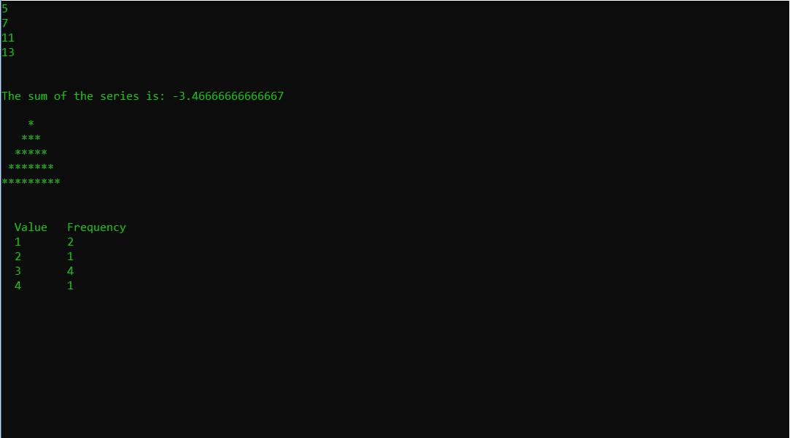

# Assignment1_S19
Warm-up programming warm up assignment for Distributed Information Systems ISM 6225 Spring 2019.

**There are four methods:**

1. PrintPrimeNumbers(int x, int y);
2. GetSeriesResult(int n);
3. PrintTriangle(int n);
4. ComputeFrequency(int[] arr);

## Method Outputs

